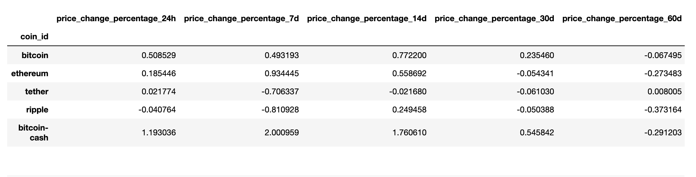
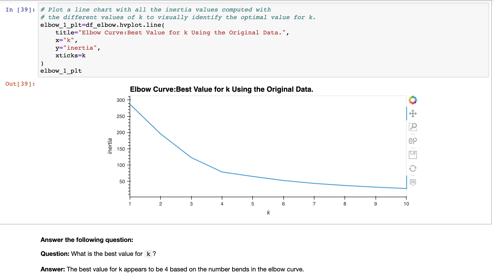
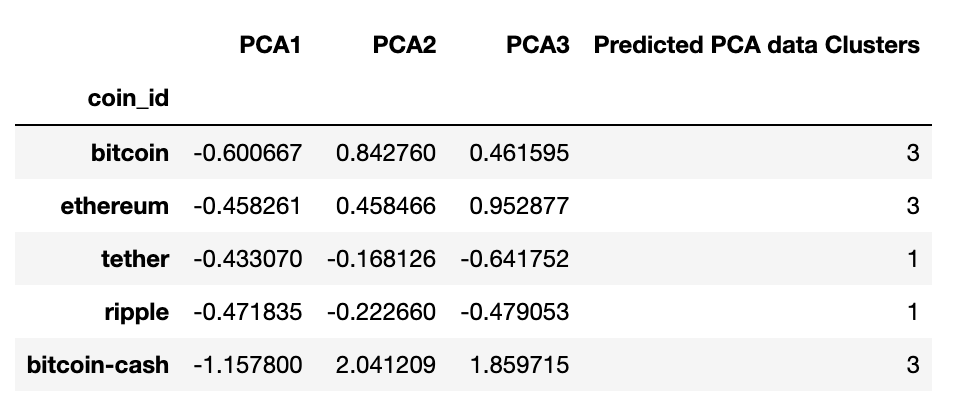
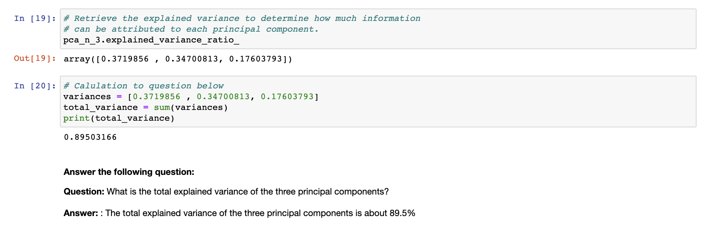
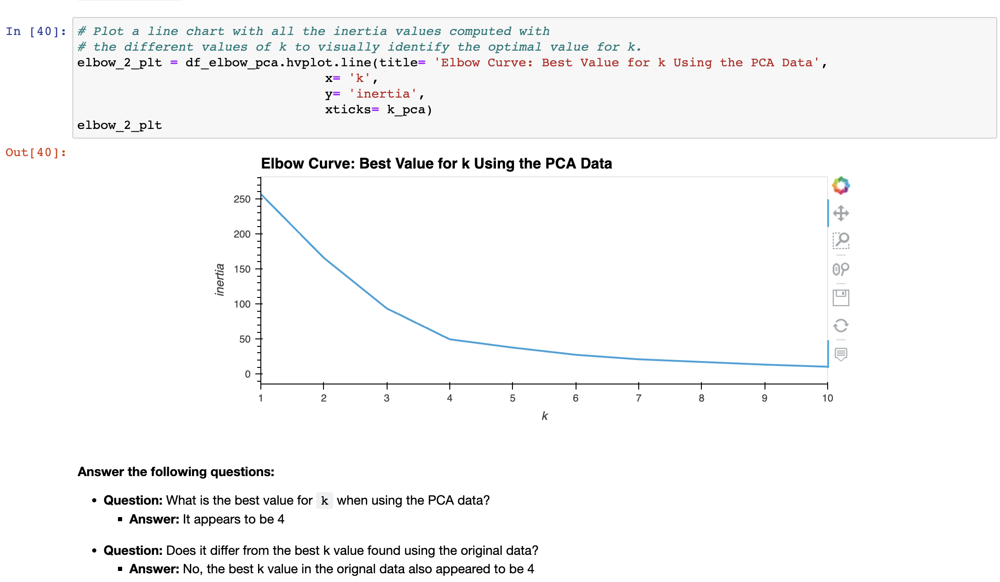

# CryptoClustering
***Project objective:*** This project uses unsupervised learning to predict if cryptocurrencies are affected by 24-hour or 7-day price changes.

After preparing the data by scaling the values, this project can be broken down into 5  parts: 

**Part 1 - Finding the Best Value for k Using the Original Scaled DataFrame:** Created a list with k values from 1 to 11 and an empty list for inertia values. Created a for loop to compute the inertia with each possible value of k. Created a dictionary with the data to plot the elbow curve.
Ploted a line chart with all the inertia values computed with the different values of k to visually identify the optimal value for k.

*Conclusion:* The best value for k appears to be 4

**Part 2 - Cluster Cryptocurrencies with K-means Using the Original Scaled Data:** Initialized the K-means model with the best value for k.
Fit the K-means model using the original scaled DataFrame.
Predicted the clusters to group the cryptocurrencies using the original scaled DataFrame. Created a copy of the original data and add a new column with the predicted clusters. Created a scatter plot using hvPlot.

**Part 3 - Optimize Clusters with Principal Component Analysis:** Using the original scaled DataFrame, performed a PCA and reduced the features to three principal components. Retrieved explained variance to determine how much information can be attributed to each principal component. Created a new DataFrame with the PCA data and set the "coin_id" index from the original DataFrame as the index for the new DataFrame.

*Conclusion:* The total explained variance of the three principal components is about 89.5%

**Part 4 - Find the Best Value for k Using the PCA Data:** Used the elbow method again but this time on the PCA data to find the best value for k 

*Conclusion:* the best fit for k still appears to be 4 which does not differ from the orignal data

**Part 5 - Cluster Cryptocurrencies with K-means Using the PCA Data:** Clustered the cryptocurrencies for the best value for k on the PCA data. Created a copy of the DataFrame with the PCA data, and then add a new column to store the predicted clusters. Created a scatter plot using hvplot, setting x="PC1" and y="PC2". Colored the graph points with the labels that you found by using K-means. Added the crypto name to the hover_cols parameter to identify the cryptocurrency that each data point represents.

**Final Analysis:** By looking at the elbow curves and scatter plots side-by-side, I answered the following quesiton

